# **权重 (weights) 的随机初始化**。

```python
X_train = np.array([[1.0], [2.0]], dtype=np.float32)           
Y_train = np.array([[300.0], [500.0]], dtype=np.float32)      
```
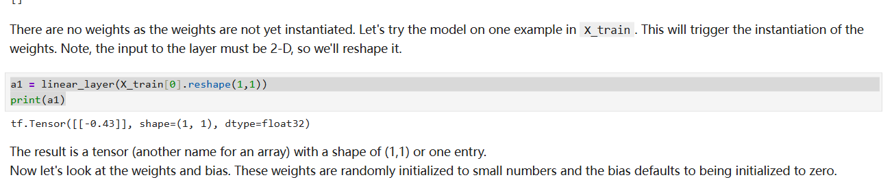


这个 `-0.43` 不是凭空出现的，它是线性层 (linear_layer) 进行数学计算后得到的结果。这个计算遵循一个经典的公式：

**`输出 = (输入 * 权重) + 偏置`**
(`output = (input * weight) + bias`)

现在，我们来一步步分解，看看在您的例子中这几个值分别是什么：

### 1. 输入 (Input)

这个很明确，就是您传入函数的值：
*   `X_train[0]` 是 `[1.0]`。
*   经过 `.reshape(1,1)` 后，输入变成了 `[[1.0]]`。
*   所以，**输入值是 `1.0`**。

### 2. 权重 (Weight)

这是理解 `-0.43` 来源的**关键**！
*   看图片中的文字描述：“**These weights are randomly initialized to small numbers...**” (这些权重被随机初始化为一些小的数值)。
*   当您第一次调用 `linear_layer` 时，TensorFlow 就在内部创建了它的权重变量 `w`。它不知道正确的权重应该是多少，所以它就**随机猜一个很小的数**作为起点。
*   在您**这一次**运行中，TensorFlow 随机选择的那个数字**恰好就是 `-0.43`**。
*   所以，**权重 `w` 的值是 `-0.43`**。

> **重要提示**：如果您从头开始重新启动并运行这个 Notebook，权重会再次被随机初始化，您可能会得到一个完全不同的数字，比如 `0.15` 或者 `-0.81` 等等。

### 3. 偏置 (Bias)

*   图片中的文字描述说：“**...and the bias defaults to being initialized to zero.**” (...并且偏置默认被初始化为零)。
*   所以，**偏置 `b` 的值是 `0`**。

### 让我们把它们代入公式

现在我们有了所有的部分，可以进行计算了：

`输出 = (输入 * 权重) + 偏置`
`a1 = (1.0 * -0.43) + 0`
`a1 = -0.43`

**这就是 `-0.43` 这个数字的由来。**

### 总结与延伸

您可以把神经网络的训练过程想象成这样：

1.  **随机猜测**：网络最开始对权重（比如这里的 `-0.43`）进行一次完全随机的猜测。
2.  **计算结果**：用这个随机的权重进行一次计算，得到一个初步的结果（比如 `-0.43`）。
3.  **比较差距**：拿这个结果 (`-0.43`) 和我们期望的真实目标 (`Y_train` 中的 `300.0`) 进行比较，发现差距巨大。
4.  **学习和调整**：神经网络通过一个叫做“反向传播”和“梯度下降”的过程，微调它的权重，让下一次的计算结果能离真实目标更近一点。
5.  **重复**：不断重复第 2-4 步成千上万次，权重会从最初随机的 `-0.43` 被逐渐调整到一个最优的值，使得输入 `1.0` 时，输出能非常接近 `300.0`。
   

# **布尔索引 (Boolean Indexing)** 或 **掩码 (Masking)**

### **如何根据标签（或条件）来筛选和可视化数据**  
- 示例代码如下：
```
# 创建数据集：特征和标签
X_train = np.array([0., 1, 2, 3, 4, 5], dtype=np.float32).reshape(-1,1)  
Y_train = np.array([0,  0, 0, 1, 1, 1], dtype=np.float32).reshape(-1,1) 

pos = Y_train == 1
neg = Y_train == 0
X_train[pos]
```

### **第二部分：最关键的逻辑 - 布尔索引**

这是您可能感到困惑的核心。这个操作叫做 **布尔索引 (Boolean Indexing)** 或 **掩码 (Masking)**。

```python
pos = Y_train == 1
neg = Y_train == 0
```

1.  `pos = Y_train == 1` 是什么意思？
    *   它不是一个普通的赋值语句，而是一个**比较操作**。
    *   NumPy会逐个元素地将 `Y_train` 中的值与 `1` 进行比较。
    *   如果元素**等于** `1`，就在对应位置返回 `True`。
    *   如果元素**不等于** `1`，就在对应位置返回 `False`。

    我们来看一下具体的计算过程：
    *   `Y_train` 是: `[[0.], [0.], [0.], [1.], [1.], [1.]]`
    *   `Y_train == 1` 的结果是: `[[False], [False], [False], [True], [True], [True]]`
    *   所以，变量 `pos` 现在就是一个由 `True` 和 `False` 组成的**布尔数组 (boolean array)**。

2.  `X_train[pos]` 是什么意思？
    *   这行代码的意思是：“**从 `X_train` 中，只取出那些在 `pos` 数组中对应位置为 `True` 的元素**”。
    *   `pos` 数组在第3、4、5个位置（索引从0开始）是 `True`。
    *   所以，它就会去 `X_train` 中取出第3、4、5个位置的元素。
    *   `X_train` 中对应位置的元素是 `3.`、`4.` 和 `5.`。
    *   因此，`X_train[pos]` 的输出就是 `array([3., 4., 5.])`。

同理，`neg = Y_train == 0` 会得到 `[[True], [True], [True], [False], [False], [False]]`，所以 `X_train[neg]` 会取出 `X_train` 中前三个元素 `[0., 1., 2.]`。

---

### **将逻辑应用于绘图**

现在我们理解了 `pos` 和 `neg` 是两个“筛选器”，再来看绘图代码就非常清晰了。

1.  **绘制正例 (Positive Cases)**:
    ```python
    ax.scatter(X_train[pos], Y_train[pos], marker='x', s=80, c = 'red', label="y=1")
    ```
    *   `X_train[pos]`: 只取出所有 `y=1` 的点的 x 坐标 `[3, 4, 5]`。
    *   `Y_train[pos]`: 只取出所有 `y=1` 的点的 y 坐标 `[1, 1, 1]`。
    *   所以这行代码画出了三个点：(3, 1), (4, 1), (5, 1)。
    *   `marker='x'` 表示用 'x' 形状来画，`c='red'` 表示用红色。

2.  **绘制负例 (Negative Cases)**:
    ```python
    ax.scatter(X_train[neg], Y_train[neg], marker='o', s=100, label="y=0", ...)
    ```
    *   `X_train[neg]`: 只取出所有 `y=0` 的点的 x 坐标 `[0, 1, 2]`。
    *   `Y_train[neg]`: 只取出所有 `y=0` 的点的 y 坐标 `[0, 0, 0]`。
    *   所以这行代码画出了三个点：(0, 0), (1, 0), (2, 0)。
    *   `marker='o'` 表示用 'o' 形状来画，颜色是蓝色。

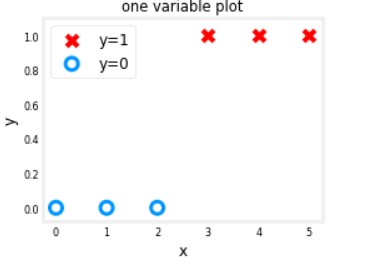

--- 

# `keras.layers.Dense` 参数解析

`keras.layers.Dense(1, input_dim=1,  activation = 'sigmoid', name='L1')`

这行代码在 Keras 中定义了一个全连接层（Dense layer）。下面是每个参数的详细解释：

*   **`Dense`**: `Dense` 是 Keras 中用来创建全连接层的类。在全连接层中，每个神经元都与前一层的所有神经元相连接。 这个层实现了一个基本的数学运算：`output = activation(dot(input, kernel) + bias)`，其中 `kernel` 是权重矩阵，`bias` 是偏置向量，`activation` 是激活函数。

*   **`1` (第一个参数 `units`)**: 这个参数定义了该层中神经元（或称为单元）的数量。 在这个例子中，`units=1` 表示该层只有一个神经元。这个值决定了该层的输出空间的维度。

*   **`input_dim=1`**: 这个参数指定了输入数据的维度。 `input_dim=1` 意味着输入到这一层的数据是一个一维向量。**注意：** `input_dim` 或 `input_shape` 参数通常只需要在模型的第一层设置，因为后续的层可以自动推断出输入的形状。

*   **`activation = 'sigmoid'`**: 这个参数设置了该层神经元的激活函数。激活函数的作用是向网络中引入非线性，使得神经网络能够学习和表示更复杂的模式。
    *   **Sigmoid 函数**: Sigmoid 函数会将任何实数值压缩到 0 和 1 之间。 这使得它特别适用于二元分类问题的输出层，因为输出可以被解释为概率。

*   **`name='L1'`**: 这个参数为该层指定了一个唯一的名称 "L1"。在构建复杂的网络模型时，为层命名是一个好习惯，这有助于后续的模型可视化、调试和层操作。

--- 

# 特征归一化 Feature Normalization
```
print(f"Temperature Max, Min pre normalization: {np.max(X[:,0]):0.2f}, {np.min(X[:,0]):0.2f}")
print(f"Duration    Max, Min pre normalization: {np.max(X[:,1]):0.2f}, {np.min(X[:,1]):0.2f}")
norm_l = tf.keras.layers.Normalization(axis=-1)
norm_l.adapt(X)  # learns mean, variance
Xn = norm_l(X)
print(f"Temperature Max, Min post normalization: {np.max(Xn[:,0]):0.2f}, {np.min(Xn[:,0]):0.2f}")
print(f"Duration    Max, Min post normalization: {np.max(Xn[:,1]):0.2f}, {np.min(Xn[:,1]):0.2f}")
```
这段代码的核心作用是对数据进行 **特征归一化 (Feature Normalization)**，具体来说是 **标准化 (Standardization)**。整个过程分为三步：

1.  **查看原始数据**：
    前两行代码打印出原始数据 `X` 中“温度”和“时长”这两个特征在归一化之前的最大值和最小值，让你了解它们原始的数值范围。

2.  **学习并应用归一化**：
    *   `norm_l = tf.keras.layers.Normalization(...)`：创建一个 Keras 的归一化层，这个层可以学习数据的均值和标准差。
    *   `norm_l.adapt(X)`：这是最关键的一步。该层会“学习”`X` 数据中每一列（每个特征）的平均值和标准差，并把它们记下来。
    *   `Xn = norm_l(X)`：将上面学到的规则（均值和标准差）应用到 `X` 上，计算出归一化后的新数据 `Xn`。计算公式为 `(X - 平均值) / 标准差`。

3.  **查看归一化后结果**：
    最后两行代码打印出新数据 `Xn` 的最大值和最小值，用来展示归一化后的效果。通常，归一化后的数据均值接近0，标准差接近1。

**一句话总结：**

**这串代码先展示了原始数据的数值范围，然后通过一个归一化层学习数据的统计特性，并用它将数据转换到一个标准的、更适合模型训练的范围内，最后再展示转换后的结果。**

# `np.tile`
```
Xt = np.tile(Xn,(1000,1))
Yt= np.tile(Y,(1000,1))   
print(Xt.shape, Yt.shape)   
```
- 这行代码的作用是数据扩增：将原始数据集 Xn 和 Y 垂直复制1000遍，以创建一个更大的训练集。
- 详细一点说：
  * np.tile(A, (1000, 1)) 的意思就是把数组 A 沿着第一个维度（行）重复1000次，而沿着第二个维度（列）保持不变。
  * 简单来说，就是把你的整个数据集（特征Xn和标签Y）完整地复制粘贴了999次，接在原始数据下方，从而将数据量扩大了1000倍。
  * print(Xt.shape, Yt.shape) 会显示出新数组的行数确实是原始行数的1000倍，而列数保持不变。

---

# 输入数据指定

当你像这样使用 `tf.keras.Input(shape=(2,))` 作为 `Sequential` 模型的第一项时，**就再也无需在第一个 `Dense` 全连接层中指定输入数据的形状了**。

这两种写法是等效的：

**写法一 (你的写法，现代且推荐):**

```python
model = Sequential([
    tf.keras.Input(shape=(2,)),  # 显式定义模型的输入形状
    Dense(3, activation='sigmoid', name='layer1'),
    Dense(1, activation='sigmoid', name='layer2')
])
```
*   **解释**: `tf.keras.Input` 创建了一个符号化的“输入层”，它不进行任何计算，只是告诉模型：“你将会接收到形状为 (2,) 的数据”。 后面的 `Dense` 层会自动从这个输入层推断出它所需要的输入维度，并构建相应大小的权重矩阵。

**写法二 (传统写法):**

```python
model = Sequential([
    Dense(3, activation='sigmoid', input_shape=(2,), name='layer1'), # 在第一个实际层中定义输入形状
    Dense(1, activation='sigmoid', name='layer2')
])
```
*   **解释**: 这里没有独立的输入层，而是直接在第一个计算层（`Dense`层）通过 `input_shape=(2,)` 参数来告知模型输入数据的形状。

**总结:**

使用 `tf.keras.Input` 是更现代、更清晰的做法，它将模型的“接口定义”和“计算层”分离开来。尤其是在构建更复杂的模型（例如使用函数式API构建多输入或多输出模型）时，`tf.keras.Input` 是必须的。所以，你的写法是一个非常好的习惯。

---


# `model.summary()` 参数量计算

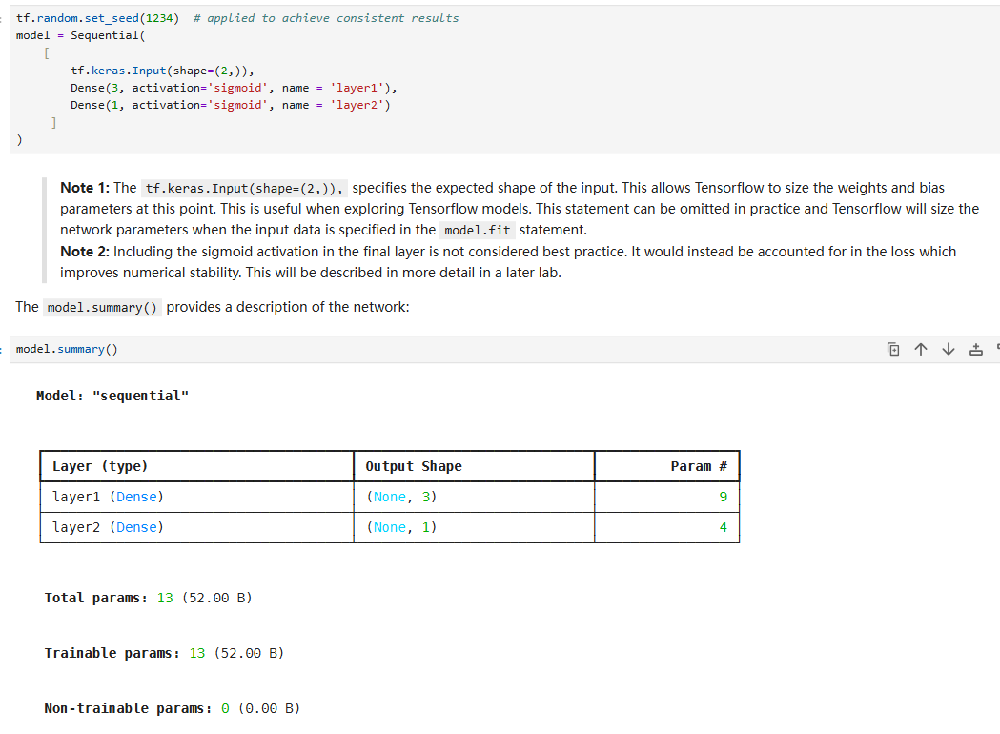

这个计算基于一个核心公式：

**一个全连接层 (Dense Layer) 的参数数量 = (输入特征数 × 当前层神经元数) + 当前层神经元数**

这里的 `(输入特征数 × 当前层神经元数)` 是权重 (weights) 的数量，而 `当前层神经元数` 是偏置 (biases) 的数量，因为每个神经元都有一个自己的偏置项。

现在我们来分解计算图中的两个层：

### 1. **layer1 (Dense)**

*   **输入特征数**: 2 (来自 `tf.keras.Input(shape=(2,))`)
*   **当前层神经元数**: 3 (来自 `Dense(3, ...)`)
*   **计算**:
    *   权重数量 = `2 * 3 = 6`
    *   偏置数量 = `3`
    *   **总参数 = 6 + 3 = 9**

这与 `model.summary()` 中 `layer1` 对应的 `Param #` 为 9 完全吻合。

### 2. **layer2 (Dense)**

*   **输入特征数**: 3 (这层的输入是上一层 `layer1` 的输出。从 `Output Shape` 列可以看到，`layer1` 的输出形状是 `(None, 3)`，所以有3个特征)
*   **当前层神经元数**: 1 (来自 `Dense(1, ...)`)
*   **计算**:
    *   权重数量 = `3 * 1 = 3`
    *   偏置数量 = `1`
    *   **总参数 = 3 + 1 = 4**

这也与 `model.summary()` 中 `layer2` 对应的 `Param #` 为 4 完全吻合。

### 总参数 (Total params)

最后，总参数就是所有层的参数之和：

**Total params = (layer1 的参数) + (layer2 的参数) = 9 + 4 = 13**

### 关于 `Note 2` 的补充说明

截图中 `Note 2` 提到：“在最后一层包含 sigmoid 激活函数不是最佳实践”。

这是因为将 `sigmoid` 函数和损失函数（如二元交叉熵）分开计算可能会导致数值不稳定（例如，当输入非常大或非常小时，浮点数精度会出问题）。

更好的做法是：
1.  在最后一层 **不设置激活函数** (`activation=None`)，让它直接输出原始的逻辑值（logits）。
2.  在编译模型 `model.compile()` 时，选择一个能够接收 logits 的损失函数，例如 `tf.keras.losses.BinaryCrossentropy(from_logits=True)`。

这样做会把 `sigmoid` 运算和损失计算合并在一起，用一种数值上更稳定的方式来完成，从而提高模型的训练效果和稳定性。

---

# 权重维度

**因为每个神经元都需要与所有的输入特征相连接，而权重矩阵的每一 *列* 都代表一个神经元所对应的权重。**


### 核心思想：矩阵乘法

一个全连接层的核心运算是矩阵乘法：`output = input • W + b`。我们先关注 `input • W` 这一部分。

假设我们只处理 **一个** 数据样本。因为你的输入数据是N行2列（N个样本，每个样本2个特征），所以一个样本可以表示为一个行向量 `[x1, x2]`，它的形状是 `(1, 2)`。

第一层有 **3个神经元**，这意味着我们希望为这一个输入样本计算出 **3个输出值**（每个神经元一个），所以我们期望的输出向量形状是 `(1, 3)`，可以表示为 `[z1, z2, z3]`。

现在，我们把这些形状代入矩阵乘法的规则中：

`input • W = output`
`(1, 2) • (W的形状) = (1, 3)`

根据矩阵乘法法则：
1.  第一个矩阵的 **列数** 必须等于 第二个矩阵的 **行数**。
2.  结果矩阵的形状是 (第一个矩阵的行数, 第二个矩阵的列数)。

应用这些规则：
1.  `input` 的列数是 `2`，所以 `W` 的行数必须是 `2`。
2.  我们期望的 `output` 的列数是 `3`，所以 `W` 的列数必须是 `3`。

**因此，权重矩阵 `W` 的形状必须是 `(2, 3)`。**

### 从单个神经元的角度理解

让我们换个角度，从每个神经元的工作方式来看，这样会更直观。

*   **第一个神经元 (产生输出 z1)**: 它需要接收 `x1` 和 `x2` 两个输入。为了计算它的输出，它需要两个对应的权重，我们称之为 `w11` 和 `w21`。
    `z1 = (x1 * w11) + (x2 * w21) + b1`

*   **第二个神经元 (产生输出 z2)**: 它也需要接收 `x1` 和 `x2` 两个输入，并拥有自己的一套权重，我们称之为 `w12` 和 `w22`。
    `z2 = (x1 * w12) + (x2 * w22) + b2`

*   **第三个神经元 (产生输出 z3)**: 同理，它的权重是 `w13` 和 `w23`。
    `z3 = (x1 * w13) + (x2 * w23) + b3`

现在，我们把这些权重整理成一个矩阵 `W`。为了能方便地进行矩阵运算，我们把每个神经元的权重组合成 **一列**：

```
        神经元1  神经元2  神经元3
       (的权重) (的权重) (的权重)
       --------------------------
来自x1: [ w11,    w12,    w13 ]
来自x2: [ w21,    w22,    w23 ]
```

这个矩阵的形状正是 **(2, 3)**！

*   **行 (Rows)**: 对应于 **输入的特征**。有2个输入特征，所以有2行。
*   **列 (Columns)**: 对应于 **当前层的神经元**。有3个神经元，所以有3列。

### 总结

所以，`W1` 的形状是 `(2, 3)` 是因为：
*   **2** 代表 `layer1` 的每个神经元都连接到来自前一层（即输入层）的 **2** 个特征。
*   **3** 代表 `layer1` 本身有 **3** 个神经元。

而 `b1` (偏置) 的形状是 `(3,)`，因为3个神经元中每一个都有一个自己独立的偏置项。

当你用 `model.get_layer("layer1").get_weights()` 获取权重时，它返回的正是这个 `(2, 3)` 的权重矩阵 `W1` 和 `(3,)` 的偏置向量 `b1`。

---

# epoch batch steps

*   **Epoch（轮次）**: 一轮是指整个训练数据集在神经网络中完成一次完整的前向传播和反向传播的过程。在您的代码中，`epochs=10` 表示模型将重复这个过程10次。
*   **Batch（批次）**: 由于一次性将所有数据输入模型进行训练会占用大量内存，通常会将训练数据分成许多个小的“批次”。
*   **Step（步数）**: 一个“步”是指模型处理完一个批次的数据并更新一次其内部参数（权重和偏置）的过程。

因此，`6250/6250` 的格式表示在这一轮（Epoch）训练中，总共有 6250 个步数（即6250个批次），而当前已经完成了全部 6250 个。

这个数字通常由以下公式决定：
`步数 = 训练样本总数 / 每个批次的大小 (batch_size)`

例如，如果您的训练集有 200,000 个样本，而批次大小（`batch_size`）为32，那么每个轮次的步数就是 `200,000 / 32 = 6250`。 在 `model.fit()` 函数中，如果没有明确指定 `steps_per_epoch`，Keras 会根据数据集大小和批次大小自动计算这个值。

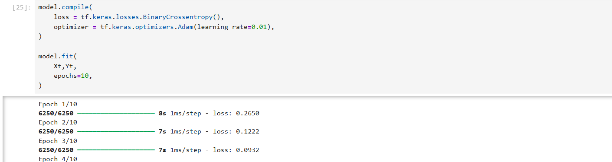

---

# **咖啡豆烘焙模型**

#### **目标：**
根据两个输入特征——**烘焙温度 (Temperature)** 和 **烘焙时长 (Duration)**——自动判断一批咖啡豆是“**好的烘焙 (Good Roast)**”还是“**不良烘焙 (Bad Roast)**”。

### **1. 数据输入 (The Raw Ingredients)**

一切始于最原始的数据。我们将一次具体烘焙的两个数值输入到网络中：
*   **输入 1**: 温度值 (例如：220.5 °C)
*   **输入 2**: 时长值 (例如：12.7 分钟)


### **2. 第一层 (Layer 1)**

输入的数据首先被送到第一层（Layer 1）。这一层有三个独立的神经元（单元0, 1, 2,每个神经元只关心一个特定的特征）。

*   **Unit 0**:
    *   **职责**: 只检查温度是否过低。
    *   **行为**: 如果温度太低，它就会被**高度激活**，输出一个接近 **1.0** 的大值。如果温度合适或偏高，它就保持沉默，输出一个接近 **0.0** 的小值。

*   **Unit 1**:
    *   **职责**: 只检查烘焙时长是否过短。
    *   **行为**: 如果时长太短，它就会被**高度激活**，输出一个接近 **1.0** 的大值。否则，它就保持沉默，输出一个接近 **0.0** 的小值。

*   **Unit 2**: 
    *   **职责**: 检查温度和时长的组合是否不合理（例如，温度和时长都偏低）。
    *   **行为**: 如果它发现这种不匹配的组合，它就会被**高度激活**，输出一个接近 **1.0** 的大值。否则，它就保持沉默，输出一个接近 **0.0** 的小值。

**本阶段小结：**
第一层是 **“问题发现层”**。它的任何一个神经元输出一个**大值**，都意味着检测到了一个可能导致“不良烘焙”的**危险信号**。

### **3. 第二层 (Layer 2)**

三个0到1之间的输出值被同时提交给了第二层（Layer 2），也就是最终的输出单元，并计算出这次烘焙是“**好的烘焙**”的**概率**。

为了完成这个任务，`Layer 2` 在训练中学会了一条至关重要的、**反向的决策逻辑**：

*   **决策规则**:
    *   “如果收到了来自**任何一位**检验员的**大值**报告（危险信号），那就意味着这次烘焙肯定有问题。因此，必须给出一个非常**小**的最终分数，表示它是‘好的烘焙’的概率极低。”
    *   “**只有当**收到的**所有三份**报告都是**小值**，才能放心地给出一个非常**大**的最终分数，表示它是‘好的烘焙’的概率很高。”

**本阶段小结：**
第二层是**“决策整合层”**。它将第一层的**危险信号（大值）**，转化为对“好的烘焙”的**低概率（小值）**。它是一个**逆向思维**的决策者。

### **4. 最终分类盖章 (The Final Verdict)**

`Layer 2` 给出了一个最终的概率分数（例如 0.92 或者 0.15）。但我们通常需要一个明确的“是”或“否”的结论。

这时，我们应用一个简单的**决策阈值 (Decision Threshold)**，就像盖上“合格”或“不合格”的印章一样。

*   **盖章规则 (由代码 `yhat = (fwb > 0.5).astype(int)` 定义)**:
    *   如果最终的概率分数 **大于 0.5**，我们就给它盖上“**预测为好的烘焙 (Predicted Good Roast)**”的标签。
    *   如果最终的概率分数 **小于或等于 0.5**，我们就给它盖上“**不良烘焙 (Bad Roast)**”的标签。

### **流程总结表**

| 阶段 | 角色 | “大值” (接近1.0) 的含义 | “小值” (接近0.0) 的含义 |
| :--- | :--- | :--- | :--- |
| **Layer 1** | 问题检验员 | **检测到问题！** (例如温度太低) | 一切正常，未发现此问题 |
| **Layer 2** | 品控总监 | **“好的烘焙”的概率很高** | **“好的烘焙”的概率很低** |
| **最终决策** | 分类器 | 最终判定为 **“好的烘焙”** | 最终判定为 **“不良烘焙”** |

通过这个四步流程，神经网络就成功地将两个原始的数字输入，转化成了一个有意义的、自动化的分类决策。

---

# 多分类

## **1. 从二分类到多分类**

在机器学习中，我们经常遇到需要将数据分到两个以上类别的问题，这就是**多分类（Multi-class Classification）**。

*   **二分类 (Binary)**：任务是判断“是”或“否”。例如，判断一封邮件是否为垃圾邮件。模型学习一条**决策边界**，将数据分为两部分。
*   **多分类 (Multiclass)**：任务是从多个类别中选择一个。例如，识别图片中的动物是猫、狗还是马。模型需要学习更复杂的**决策区域**，为每个类别划分出专属的“领地”。

本次实验的目标，就是构建一个神经网络，来解决一个4分类问题。

## **2. 创建并可视化数据集**

在训练模型之前，我们首先需要一套合适的“教材”——也就是数据集。

### **2.1. 数据集创建**

我们使用 Scikit-Learn 的 `make_blobs` 函数来生成一个理想的模拟数据集。这让我们能够精确控制数据的分布，便于观察模型的学习效果。

**关键代码解读**：
```python
from sklearn.datasets import make_blobs

# 1. 定义4个类别的中心点坐标
centers = [[-5, 2], [-2, -2], [1, 2], [5, -2]]

# 2. 使用make_blobs生成100个样本
#    n_samples: 样本总数
#    centers: 类别中心
#    cluster_std: 类内数据点的离散程度
#    random_state: 确保每次生成的随机数据都一样，便于复现
X_train, y_train = make_blobs(n_samples=100,
                                centers=centers,
                                cluster_std=1.0,
                                random_state=30)
```
*   `X_train`: 包含了100个数据点的坐标 `(x1, x2)`。其数据维度为 `(100, 2)`。
*   `y_train`: 包含了每个数据点对应的类别标签 `(0, 1, 2, 或 3)`。其数据维度为 `(100,)`。

### **2.2. 数据集可视化**

创建数据后，我们将其可视化，直观地感受数据分布。图中四个颜色的数据簇分别代表四个类别（c0, c1, c2, c3）。
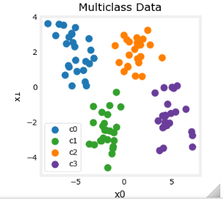

## **3. 模型构建与训练**

现在，我们来构建解决此问题的神经网络。

### **3.1. 模型架构剖析**

本次实验采用了一个包含两个全连接层（Dense Layer）的序贯模型（Sequential Model）。
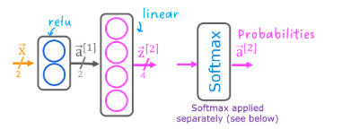

**Keras 实现**:
```python
import tensorflow as tf
from tensorflow.keras.models import Sequential
from tensorflow.keras.layers import Dense

model = Sequential([
    Dense(2, activation='relu', name="L1"),
    Dense(4, activation='linear', name="L2")
])
```

#### **第一层 (L1 - 特征提取层)**
*   `Dense(2, ...)`: 这一层有**2个神经元**。
*   `activation='relu'`: 使用 **ReLU (Rectified Linear Unit)** 激活函数。这个函数非常高效，它能为模型**引入非线性**，使得模型可以学习比直线更复杂的边界。

#### **第二层 (L2 - 输出决策层)**
*   `Dense(4, ...)`: 这一层有**4个神经元**，数量必须与我们的**类别总数**（4类）完全一致。每个神经元对应一个类别。
*   `activation='linear'`: 使用**线性激活函数**（即不进行任何激活变换）。这意味着这一层的输出是原始的、未经过压缩的数值。这些原始数值我们称为 **Logits**。

> **为什么输出层不用常见的 `softmax` 激活函数？**：  
> 这是一个非常关键且高效的设计。直接输出 Logits，再将 Logits 传入损失函数，这种做法在计算上**更为稳定**。Keras的损失函数有一个专门的参数来支持这种模式。

### **3.2. 模型的编译与损失函数**

编译是为模型指定“学习工具”的过程。

```python
model.compile(
    loss=tf.keras.losses.SparseCategoricalCrossentropy(from_logits=True),
    optimizer=tf.keras.optimizers.Adam(0.01),
)
```

#### **损失函数 (Loss Function)**
*   `SparseCategoricalCrossentropy(from_logits=True)`: 这是多分类问题的“标准”损失函数。
    *   **Categorical Cross-Entropy (交叉熵)**：衡量模型预测的概率分布与真实标签分布之间的差异。差异越大，损失值越高。
    *   **Sparse (稀疏)**：表示我们的真实标签 `y_train` 是整数形式（0, 1, 2, 3），而不是 One-Hot 编码形式（如 `[0, 1, 0, 0]`）。
    *   `from_logits=True`: **这是整个模型设计的点睛之笔！** 这个参数告诉损失函数：“我从模型输出层接收到的不是经过 Softmax 计算后的概率，而是原始的 Logits。请你**在内部先进行 Softmax 计算，然后再计算损失**。”

#### **优化器 (Optimizer)**
*   `Adam(0.01)`: Adam 是一种高效且常用的优化算法，它会根据损失值的大小，智能地调整模型的内部参数（权重和偏置），以达到降低损失的目的。`0.01`是学习率。

### **3.3. 模型训练**

一切准备就绪，开始训练！

```python
model.fit(
    X_train, y_train,
    epochs=200
)
```
模型将完整地“看”200遍整个数据集（`epochs=200`），并在此过程中不断优化自己。

## **4. 神经网络的“思考”过程**

模型训练完成后，成功地在各类数据间画出了清晰的决策边界。但它是**如何**做到的呢？这正是神经网络的魅力所在。

### **4.1. 第一层 (Layer 1) 的功能：学习成为“线性分割器”**

第一层的两个ReLU神经元（Unit 0, Unit 1）各自学会了从不同角度对原始数据空间进行分割。它们是**特征提取器**。

*   **Unit 0**: 学会了一条近似水平的分割线。对于线下方的数据点（蓝色c0和绿色c1），它的输出值接近0；对于线上方的数据点，输出值大于0。它成功地将 `{c0, c1}` 与 `{c2, c3}` 进行了初步分离。
*   **Unit 1**: 学会了一条近似垂直的分割线。对于线左侧的数据点（蓝色c0和橙色c2），它的输出值接近0；对于线右侧的数据点，输出值大于0。它成功地将 `{c0, c2}` 与 `{c1, c3}` 进行了初步分离。

> **导师深度解读**：
> 第一层将原始的、难以直接分离的 `(x1, x2)` 坐标，转换成了一个新的、更有信息量的**特征空间** `(a_unit0, a_unit1)`。在这个新的空间里，数据变得更容易被区分，为第二层的工作铺平了道路。

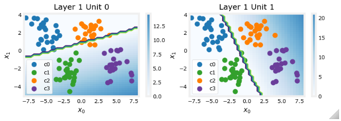

### **4.2. 第二层 (Layer 2) 的功能：成为“最终决策者”**

第二层的四个线性神经元（Linear Output Unit 0-3）接收来自第一层创造的新特征，并各自为自己所代表的类别“打分”。

观察下图，可以发现：

*   **Linear Output Unit 0**: 当输入特征 `(a_unit0, a_unit1)` 都接近0时（即原始数据点位于两条分割线的左下方），它的输出值（背景颜色最亮）达到最大。这正是**类别0（蓝色）**所在的区域！
*   **Linear Output Unit 1**: 当 `a_unit0` 较大而 `a_unit1` 接近0时（原始数据点在右下方），它的输出值最大。这正是**类别1（绿色）**所在的区域。
*   **Linear Output Unit 2**: 当 `a_unit0` 接近0而 `a_unit1` 较大时（原始数据点在左上方），它的输出值最大。这正是**类别2（橙色）**所在的区域。
*   **Linear Output Unit 3**: 当 `a_unit0` 和 `a_unit1` 都较大时（原始数据点在右上方），它的输出值最大。这正是**类别3（紫色）**所在的区域。

> **解读**：
> 对于任何一个输入的数据点，第二层的四个神经元都会输出一个Logit值。**哪个神经元的Logit值最大，模型就预测该数据点属于哪个类别**。这个过程被称为 **Argmax**，它是由 Softmax 函数隐式完成的。

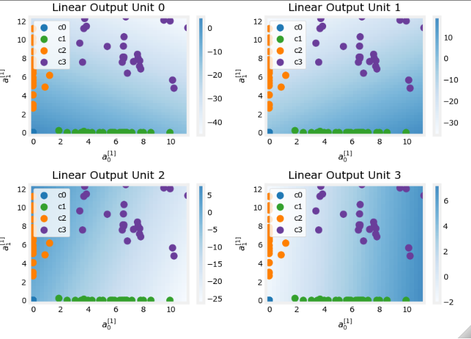

## **5. 核心概念对比与总结**

为了加深理解，我们对比一下两种常见的多分类输出层设计方案。

| **对比项** | **方案A (本次实验采用)** | **方案B (传统方案)** |
| :--- | :--- | :--- |
| **输出层激活** | `linear` (输出 Logits) | `softmax` (直接输出概率) |
| **损失函数** | `SparseCategoricalCrossentropy(from_logits=True)` | `SparseCategoricalCrossentropy(from_logits=False)` |
| **优点** | **数值计算更稳定**，避免了复杂的浮点数运算可能带来的精度问题。 | **输出直观**，直接就是各类别的概率值，便于直接解释。 |
| **何时使用** | **强烈推荐**。这是目前主流深度学习框架（如TensorFlow, PyTorch）推荐的标准实践。 | 在需要模型直接输出概率，且不太担心数值稳定性的小型项目中可以使用。 |

### **最终总结**

通过本次实验，我们完整地经历了一个多分类神经网络从构建到“思考”的全过程。其核心思想可以概括为：

1.  **分而治之**：网络通过分层结构，将一个复杂的多分类问题分解为多个简单的子问题。
2.  **特征变换**：第一层（隐藏层）作为特征提取器，将原始输入数据映射到一个新的、更有利于分类的特征空间。
3.  **综合决策**：第二层（输出层）在新特征空间上工作，每个神经元成为一个类别的“拥护者”，通过输出最高的Logit值来赢得最终的分类决策权。
4.  **高效实现**：采用 `Linear` 输出 + `from_logits=True` 的损失函数，是兼顾了模型性能和数值稳定性的最佳实践。

### 相关问题

#### **关于背景颜色的含义**

这是一个关于**模型可视化与可解释性**的绝佳问题。在您提供的不同图中，背景颜色代表的含义略有不同，但核心思想一致：**它展示了在二维坐标系的每一个点上，某个神经元或整个模型的“响应强度”**。

让我们具体分析：

1.  **在“第一层(Layer 1)功能”的图中** (例如 "Unit 0" 或 "Unit 1" 的图):
    *   **背景色代表单个神经元的输出值（激活值）**。
    *   颜色越亮/越暖（例如黄色），代表该神经元在此处的输出值越大（接近其最大值）。
    *   颜色越暗/越冷（例如深紫色），代表该神经元的输出值越小（接近0）。
    *   例如，在 "Unit 0" 的图中，线下方的区域是深色的，说明 Unit 0 在这些点的输出值都接近0。

2.  **在“第二层(Layer 2)功能”的图中** (例如 "Linear Output Unit 0" 的图):
    *   **背景色代表第二层单个输出神经元的原始输出值 (Logit)**。
    *   颜色越亮，代表该神经元为它所代表的类别打出的“分数”越高。
    *   例如，在 "Linear Output Unit 0" 的图中，左下角的区域最亮，说明这个神经元（代表类别0）在接收到来自左下角区域的信号时，会给出最高的 Logit 分数。

3.  **在最终的“决策边界”图中**:
    *   这张图的背景色综合了所有输出神经元的信息。
    *   通常，它代表的是**模型最终预测的那个类别的“置信度”或 Logit 值**。
    *   颜色最鲜明的区域，是模型最有把握的决策区。两种颜色交界处的模糊地带，就是模型的决策边界，是模型“犹豫不决”的地方。

**总结**：背景色是将神经网络内部抽象的数值，转化为我们肉眼可见的“热力图”，帮助我们直观地理解模型在不同输入下是如何响应和决策的。

#### **关于数据维度与权重计算的理解**

您对数据在网络中流动的维度变化的理解，**几乎完全正确**，而且非常清晰！这是一个非常好的底层思考习惯。我们来一步步验证：

*   **输入数据**：对于单个样本，是一个 `(x, y)` 坐标，其形状是 `(1, 2)`。
*   **第一层 (Layer 1)**：
    *   有2个神经元，接收 `(1, 2)` 的输入。
    *   为了将 `(1, 2)` 映射到 `(1, 2)`，权重矩阵 `W1` 的形状必须是 `(2, 2)`。（输入特征数 x 神经元数）
    *   计算过程： `(1, 2)` @ `(2, 2)` -> `(1, 2)`。所以第一层的输出 `a1` 的形状是 `(1, 2)`。
*   **第二层 (Layer 2)**：
    *   有4个神经元，接收来自第一层的 `(1, 2)` 输出。
    *   为了将 `(1, 2)` 映射到 `(1, 4)`，权重矩阵 `W2` 的形状必须是 `(2, 4)`。
    *   计算过程： `(1, 2)` @ `(2, 4)` -> `(1, 4)`。所以第二层的输出 `z2` 的形状是 `(1, 4)`。

#### **一个关键的精度修正**

您最后的结论“也就是每种类别分布的概率”，这是最需要澄清的一点。

*   您推导出的最终 `(1, 4)` 输出，在我们的模型设计中，代表的是 **Logits (原始分数)**，而不是直接的 **概率 (Probabilities)**。
*   **Logits** 是未经 Softmax 函数归一化的原始数值，可以是任何实数（例如 `[10.2, -3.1, 0.5, 8.8]`）。
*   **Probabilities** 是经过 Softmax 函数处理后的结果，它们的值都在0到1之间，且总和为1（例如 `[0.88, 0.0, 0.02, 0.1]`）。

所以，您的整个维度推导是100%正确的。唯一的修正点是：最终的 `(1, 4)` 输出在传递给损失函数时，代表的是 **Logits**，而**概率的计算被巧妙地整合进了损失函数内部**（因为我们设置了 `from_logits=True`）。

---

#### **如何确定神经网络的层数和神经元数量？**

这是所有深度学习从业者都会面临的“百万美元问题”，它更像是一门**艺术与科学相结合的学问**，没有一成不变的公式。但是，有一些非常实用的指导原则和最佳实践。

#### **A. 输出层的确定：这是固定的**

输出层的结构是由你的**问题类型**严格决定的，没有选择余地。

*   **二分类**：1个神经元，使用 `sigmoid` 激活函数。
*   **多分类**：**N个神经元**（N为类别总数），使用 `softmax` 激活函数（或像我们实验中一样，使用 `linear` 激活+`from_logits`损失）。
*   **回归问题**（预测一个连续值）：1个神经元，使用 `linear`（无）激活函数。

#### **B. 隐藏层的层数与神经元数量：这是一个迭代的过程**

对于隐藏层，遵循“**从简单开始，逐步迭代**”的黄金法则。

1.  **层数 (深度)**：
    *   **0层**：如果你的数据是线性可分的，逻辑回归就够了。
    *   **1层**：一个隐藏层可以拟合**任何连续函数**。对于大多数相对简单的表格数据、非复杂问题，**从1个隐藏层开始是绝佳的起点**。
    *   **2层**：两个隐藏层可以更好地表示具有复杂形状和不连续性的函数。当1层网络效果不佳时，可以尝试增加到2层。
    *   **3层以上**：这才真正进入“深度”学习的范畴。通常用于处理具有层次结构特征的复杂数据，如**图像识别 (CNN)、语音处理 (RNN) 和自然语言处理 (Transformer)**。对于普通表格数据，超过3层很少带来显著提升，且更容易过拟合。

2.  **神经元数量 (宽度)**：
    *   **没有固定规则**，但有一些常见的启发式方法：
        *   通常在输入层特征数和输出层神经元数之间。
        *   常见的做法是设计成一个**金字塔形/漏斗形**，逐层减少神经元数量（例如 `输入 -> 256 -> 128 -> 64 -> 输出`）。这被认为有助于网络学习从具体到抽象的特征表示。
        *   神经元数量太少，模型可能**欠拟合**（学不会数据的复杂模式）。
        *   神经元数量太多，模型可能**过拟合**（记住了训练数据，但泛化能力差），并且会增加大量计算成本。
        *   出于硬件优化原因，大家习惯性地使用2的幂次方（如32, 64, 128, 256），但这并非硬性要求。

#### **C. 终极策略：科学的实验流程**

1.  **建立基线**：从一个简单的模型开始（例如1个隐藏层，神经元数量是输入特征数的两倍）。
2.  **观察学习曲线**：训练模型并观察训练集和验证集的损失。
    *   如果**两者损失都很高**，说明模型**欠拟合**。此时应**增加模型的复杂度**（增加神经元数量或增加层数）。
    *   如果**训练集损失很低，但验证集损失很高**，说明模型**过拟合**。此时应**降低模型复杂度**，或采用正则化（Dropout, L1/L2）等技术。
3.  **迭代优化**：根据观察到的现象，调整网络结构，重复实验，直到找到一个在验证集上表现最好的平衡点。


---

# 线性回归 `Linear` 与逻辑回归 `Logistic` 的区别

### **核心区别**

| **对比项** | **线性回归 (Linear Regression)** | **逻辑回归 (Logistic Regression)** |
| :--- | :--- | :--- |
| **解决问题类型** | **回归 (Regression)** | **分类 (Classification)** |
| **任务目标** | 预测一个**连续的数值** | 预测一个**离散的类别** |
| **典型例子** | 预测房价、预测股票价格、预测气温 | 判断邮件是否为垃圾邮件、判断肿瘤是良性还是恶性 |
| **核心数学函数** | **y = wx + b** (一条直线) | **Sigmoid 函数** (一条S形曲线) |
| **输出结果** | 一个**具体的数值** (可以是任何实数) | 一个 **(0, 1) 之间的概率值** |
| **评估指标** | 均方误差 (MSE), R² 分数 | 准确率 (Accuracy), 精确率/召回率 (Precision/Recall), F1分数, ROC/AUC |


### **深入解读三大核心不同点**

#### **1. 目标与输出 (The "What")**

当你的目标是预测一个**具体的、连续的数值**时，请使用**线性回归**。当你的目标是判断一个事物属于**哪一个类别**时，请使用**逻辑回归**。

*   **线性回归** 的目标是找到一条能够**最好地拟合 (fit)** 数据点的直线。它的输出是一个**预测值**。
    *   **例子**：输入房子的面积（x），输出预测的房价（y），例如 250.3 万。这个输出值是连续且无界的。

*   **逻辑回归** 的目标是找到一条能够**最好地分割 (separate)** 不同类别数据点的决策边界。它的直接输出是一个**概率**。
    *   **例子**：输入肿瘤的大小（x），输出其为恶性的概率（P(y=1)），例如 0.92。这个输出值严格限制在 (0, 1) 之间。

#### **2. 核心数学机制 (The "How")**

为了实现各自的目标，它们采用了不同的数学工具。

*   **线性回归** 直接使用线性方程 `y = wx + b` 作为最终的预测模型。它假设输入和输出之间存在线性关系。

*   **逻辑回归** 则多了一个步骤。它首先也进行线性计算 `z = wx + b`，但随后必须将 `z` 值通过 **Sigmoid 函数** 进行转换，`P(y=1) = σ(z)`，从而将输出映射到概率空间。这个非线性转换是其能够进行分类的关键。

#### **3. 如何衡量“好坏” (The "Evaluation")**

既然目标不同，衡量模型性能的“尺子”自然也不同。

*   **线性回归** 的好坏，在于其预测值与真实值之间的**距离**。
    *   **均方误差 (Mean Squared Error, MSE)**：计算所有数据点的 (预测值 - 真实值)² 的平均值。这个值越小，说明线拟合得越好。

*   **逻辑回归** 的好坏，在于它 **“猜对”了多少**。
    *   **准确率 (Accuracy)**：计算 (正确分类的样本数 / 总样本数)。准确率越高，模型越好。
    *   在处理不平衡数据集时，还会用到更复杂的指标，如精确率、召回率和F1分数。

---

# 非线性激活函数 ReLU `rectified linear unit`

### **1. ReLU**

ReLU (Rectified Linear Unit，修正线性单元) 是目前深度学习中最受欢迎的激活函数之一。它的规则简单到极致：

*   **公式**: `a = max(0, z)`
    *   `z` 是神经元接收到的加权输入总和 (`z = wx + b`)。
    *   `a` 是该神经元最终的输出（激活值）。
    *   如果输入 `z` 是负数或零，输出就是 **0**。
    *   如果输入 `z` 是正数，输出就是 **z 本身**。

* 常见的激活函数：
  *   **Linear (线性)**: 输出等于输入，是一条纯粹的直线。
  *   **Sigmoid (S型)**: 将任何输入压缩到 (0, 1) 区间，常用于二分类。
  *   **ReLU**: 一半是平的（值为0），一半是斜的（值为z）。
    
    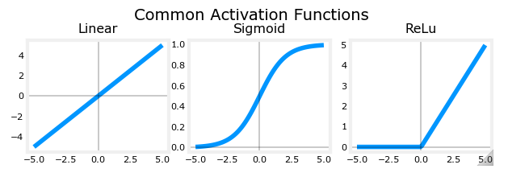

### **2. 为什么非线性如此重要？**

如果一个神经网络只使用线性激活函数（或者没有激活函数），那么无论你堆叠多少层，整个网络从头到尾都等价于一个**单层的线性模型**。它永远只能学习直线，无法拟合现实世界中各种复杂的、弯曲的函数。

**非线性激活函数（如ReLU）的加入，赋予了网络“弯曲”和“转折”的能力。**
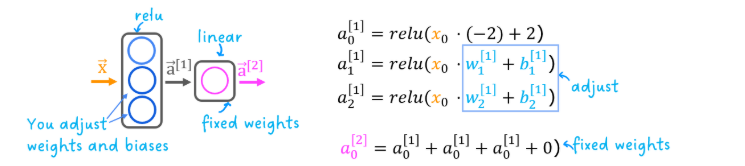

### **3. ReLU 如何通过“开关”来创造复杂性？**

ReLU 的强大之处不在于它那段线性的部分，而在于它在 **x=0** 那个点的**突变**。

**请将每一个使用ReLU的神经元，想象成一个带有“条件开关”的工人：**

*   **开关条件**: 由自身的权重 `w` 和偏置 `b` 决定。当 `wx + b < 0` 时，开关是 **“关”** 的。当 `wx + b > 0` 时，开关是 **“开”** 的。
*   **“关”的状态**: 神经元完全不工作，输出为 0，对最终结果**毫无贡献**。
*   **“开”的状态**: 神经元开始工作，输出一条直线 `wx + b`，为最终结果**贡献它的斜率**。

**您的实验目标**：用三个简单的、会“开关”的工人（3个ReLU神经元），合作搭建一个复杂的分段函数（piecewise linear function），就像用乐高积木一样，一块一块地拼接起来。


### **4. 实验分步解析：三个工人的团队合作**

让我们来看看您笔记中的具体实验，看看这三个“工人”（Unit 0, Unit 1, Unit 2）是如何合作的。最终的目标是拟合橙色的 "Match Target" 曲线。

**最终的输出 = Unit 0的输出 + Unit 1的输出 + Unit 2的输出**

#### **第一阶段：`x` 在 区间**

*   **工人0 (Unit 0)**:
    *   **任务**: 负责构建第一个向下的斜坡。
    *   **工作状态**: 在这个区间，它的开关是**“开”**的，贡献了一个负的斜率。
    *   **关键点**: 在 `x > 1` 之后，它的内部值 `z` 变成了负数，于是它的开关**“关”**了，不再对后续的曲线产生任何影响。**这是ReLU的第一个魔术：在完成自己的任务后自动“退休”。**


#### **第二阶段：`x` 在 区间**

*   **工人0 (Unit 0)**: 已经“退休”，输出为0。
*   **工人1 (Unit 1)**:
    *   **任务**: 负责构建第二个平缓向上的斜坡。
    *   **工作状态**: 当 `x` 跨过1的那一刻，它的开关从“关”变成了**“开”**，开始输出一条正斜率的直线。**这是ReLU的第二个魔术：在需要的时候准时“上岗”。**


#### **第三阶段：`x` 在 区间**

*   **工人1 (Unit 1)**: 开关保持 **“开”**，继续贡献它的那条平缓的斜坡。
*   **工人2 (Unit 2)**:
    *   **任务**: 负责让曲线变得更陡峭。
    *   **工作状态**: 当 `x` 跨过2的那一刻，它的开关也 **“开”**了，贡献了它自己的一条正斜率直线。
    *   **团队合作**: 此时，最终曲线的斜率 = **工人1的斜率 + 工人2的斜率**。两条直线叠加，形成了一条更陡的直线。

### **总结：ReLU的“拼接”艺术**

| 组件 | 角色 | 核心机制 |
| :--- | :--- | :--- |
| **单个ReLU神经元** | **一个带开关的线性模块**  | 通过权重 `w` 和偏置 `b` 决定“开关”的位置。在某个点之前输出0，之后输出一条直线。 |
| **一个ReLU隐藏层** | **一个由多个“开关模块”组成的工具箱** | 每个神经元学会负责目标函数的一小段。它们在不同的位置“开启”，贡献自己的线性部分。 |
| **最终的输出** | **所有开启的模块的线性组合** | 最终复杂的、弯曲的函数，实际上是由许多个简单的直线段“拼接”而成的。网络通过学习，自动找到了在何处以及如何进行拼接。 |

所以，神经网络的强大之处就在于，它能自动学习如何设置成千上万个这样的小“开关”（调整w和b），让它们在恰当的时机开启或关闭，从而以极高的精度拟合出任何你能想象到的复杂函数。

---

# **深度学习导师指南：从激活函数到复杂模型——ReLU的“乐高”艺术**


### **理解常见激活函数**

1.  **Linear (线性)**: `f(x) = x`
    *   **特点**: 毫无变化，输入即输出。
    *   **局限**: 如果网络中只使用线性激活，无论网络有多少层，最终都只相当于一个单层的线性模型。它永远学不会“拐弯”。

2.  **Sigmoid (S型)**:
    *   **特点**: 将任何输入压缩到 (0, 1) 区间。
    *   **用途**: 在二分类问题的输出层非常有用，因为其输出可以被直接解释为概率。

3.  **ReLU (Rectified Linear Unit)**: `f(x) = max(0, x)`
    *   **特点**: **一半是线性，一半是零**。当输入为正时，它像一个线性函数；当输入为负时，它会“关闭”，输出为0。
    *   **重要性**: 这种看似简单的“开/关”特性，是现代深度学习成功的关键之一。

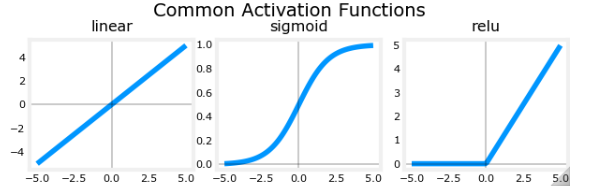


### **ReLU的魔力(1) —— 用“开关”拟合复杂曲线 (回归问题)**

您的笔记接下来探索了一个核心问题：如何用ReLU这样简单的东西，去拟合一个像 `y = np.cos(X)+1` 这样的复杂曲线？

**核心思想：将复杂的曲线看作是多段简单直线的拼接。**

#### **2.1 单个ReLU单元：一个带开关的“斜坡”**

您的笔记通过一个三图对比，完美地展示了单个ReLU单元的工作原理：

*   **图1 (y - target)**: 我们想要拟合的目标曲线。
*   **图2 (z = wX+b)**: 在ReLU激活之前，神经元内部只是一个简单的线性计算，得到一条直线 `z`。这条直线本身无法很好地拟合目标。
*   **图3 (with relu)**: 将 `z` 经过ReLU激活后，神奇的事情发生了！在 `z` 值为负的区域，输出被“截断”为0 ；在 `z` 值为正的区域，输出保持为 `z`。
   
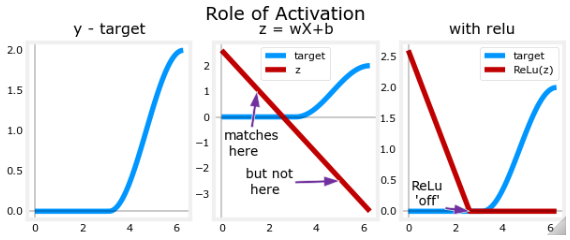

**结论**: 单个ReLU神经元就像一个**带位置开关的、可调节的斜坡**。我们可以通过调整它的权重 `w` (斜率) 和偏置 `b` (开关位置)，让它在某个点之前保持沉默(输出0)，之后贡献一段特定斜率的直线。


#### **2.2 ReLU的团队合作：用“V”形积木搭建万物**

单个ReLU只能造一个“L”形的斜坡，但如果我们将两个ReLU组合起来呢？

您的笔记展示了这一步：
`yhat = relu(d10(X)) + relu(d11(X))`

*   `relu(d10(X))`: 这是一个斜率向下的ReLU斜坡（因为 `w10 = -1`）。
*   `relu(d11(X))`: 这是一个斜率向上的ReLU斜坡（因为 `w11 = 1`）。

当把这两个“L”形的斜坡相加时，它们就组合成了一个完美的 **“V”形**！

**“啊哈！”时刻**:
这正是ReLU强大之处的精髓！通过组合足够多的、具有不同斜率（w）和开关位置（b）的ReLU单元，我们理论上可以**用许多个“V”形（或“L”形）积木，以任意精度去逼近任何复杂的连续函数**。它们就像是神经网络的“乐高积木”。

##### **2.3 自动化的艺术：让Keras模型自己学习**

手动设置 `w` 和 `b` 来搭建“V”形很有启发性，但在实践中，我们希望模型能自动完成这一切。这就是 `model.fit()` 的工作。

您构建并训练了一个简单的序贯模型：

```python
# 一个包含两个ReLU单元的隐藏层，和一个线性的输出层
model = Sequential([
    Dense(2, activation='relu', name='l1'),
    Dense(1, activation='linear', name='l2')
])
```
当您调用 `model.fit(X, y)` 时：
*   Keras会通过反向传播和梯度下降，自动地、迭代地去调整第一层两个ReLU单元的`w`和`b`，以及第二层线性单元的`w`和`b`。
*   它的目标是找到一组最佳的 `w` 和 `b`，使得两个ReLU单元产生的“V”形积木，能够最好地拼接成我们想要的目标曲线。
*   您的笔记展示了训练10个epoch后，模型的输出（红线）已经开始有了目标曲线（蓝线）的雏形，证明了学习过程是有效的。

    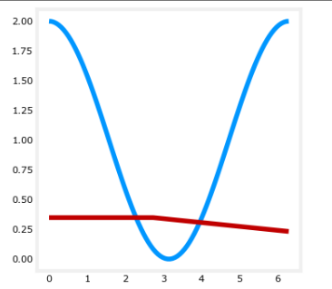


#### **第三部分：ReLU的魔力(2) —— 用“切分”解决分类问题**

接下来，您的笔记将这一思想应用到了另一个领域：**多分类问题**。

**核心思想：用ReLU在数据空间中画出直线边界，将空间切分成不同区域。**

##### **3.1 任务目标：从拟合曲线到寻找边界**

这次的目标不再是预测一个连续值，而是要画出一条（或多条）线，来区分不同类别的数据点（例如，蓝色的c0和绿色的c1）。

##### **3.2 分类模型的架构与解读**

您构建了一个用于分类的模型：
```python
model = Sequential([
    Dense(2, activation='relu', name='l1'),
    Dense(1, activation='sigmoid', name='l2')
])
```
*   **第一层 (隐藏层, ReLU)**: 这里的ReLU神经元不再是“斜坡积木”。你可以将它们想象成**“空间切割机”**。每一个ReLU神经元都会在数据空间中学习到一条直线边界。对于处在直线一侧的数据，它输出0；对于另一侧的数据，它输出一个正值。通过多个神经元，网络就在空间中进行了多次“切割”。
*   **第二层 (输出层, Sigmoid)**: 它就像一个**最终的决策者**。它接收来自第一层“切割”后的结果（这些结果形成了一个新的、更容易分类的特征空间），然后基于这些新特征，计算出样本属于类别1的概率。

##### **3.3 深入“黑箱”：权重在说什么？**


*   `w1, b1 = l1.get_weights()`: 第一层的权重和偏置，定义了那几条“切割线”的位置和方向。
*   `w2, b2 = l2.get_weights()`: 第二层的权重和偏置，定义了如何**组合**第一层切割出的结果，来形成最终那个弯曲的、非线性的决策边界。

**结论**: 在分类问题中，ReLU层的作用是将原始的、线性不可分的空间，**变换**成一个新的、更高维的、线性可分的空间，从而让最后的逻辑回归单元（Sigmoid）可以轻松完成分类任务。


### 总结与核心要点

恭喜您！通过这些笔记，您已经亲自探索并验证了现代深度学习的几个基石概念：

1.  **非线性的力量**: 没有像ReLU这样的非线性激活函数，深度网络就无法学习复杂的模式。
2.  **ReLU的双重角色**:
    *   在**回归**任务中，它扮演着**“乐高积木”**的角色，通过拼接许多简单的线性段来逼近复杂函数。
    *   在**分类**任务中，它扮演着**“空间切割机”**的角色，通过画出多条直线边界来变换特征空间，使得数据更容易被分离。
3.  **组合的力量**: 单个神经元的能力是有限的，但将它们组合在网络中，并让 `model.fit()` 自动学习如何协同工作，就能涌现出解决复杂问题的强大能力。
   
---
