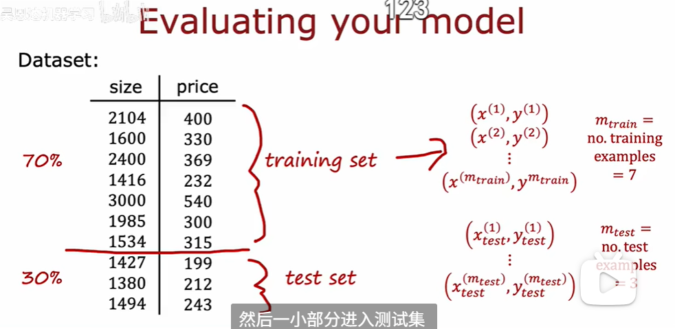
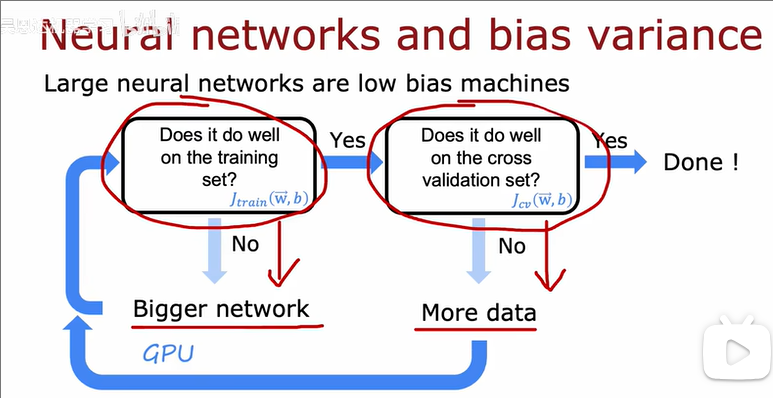
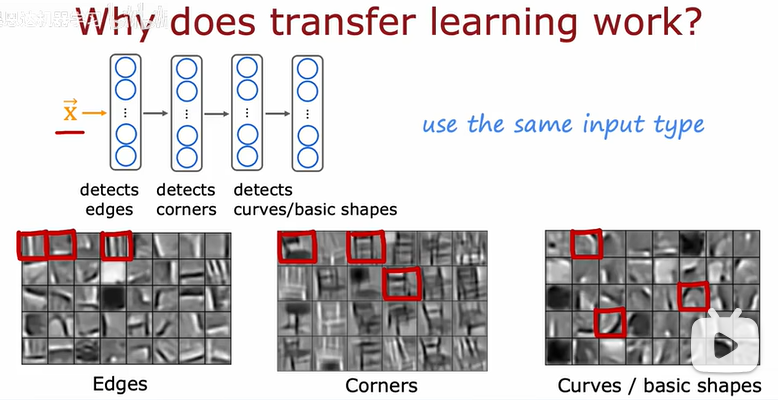
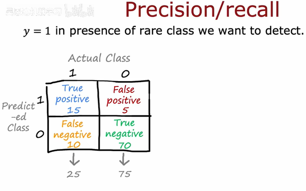
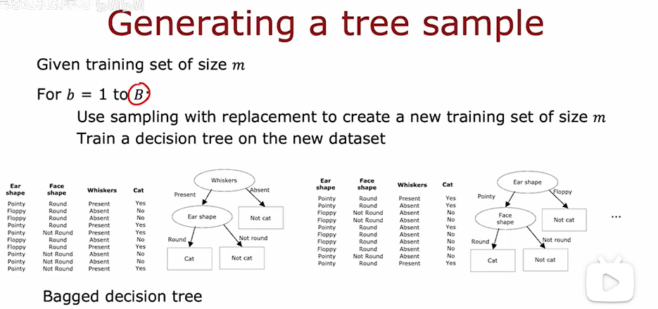

# 构建一个神经网络
  

``` 
#定义layer：第一种方法
layer_1 = Dense(units=3,activation="sigmoid")  
layer_2 = Dense(units=1,activation="sigmoid")  
model=Sequential([layer_1,layer_2])

#定义layer：第二种方法 
model=Sequential([
    Dense(units=3,activation="sigmoid"),
    Dense(units=1,activation="sigmoid")])

#数据集
x=np.array([[200,17],[120,5],[425,20],[212,18]])
y=np.array([1,0,0,1])

#调用
model.compile(...)
model.fit(x,y)

#预测
model.predict(x_new)  
```

# 前向传播 Numpy

```  
#layer实现 
def dense(a in,w,b, g):
    units =w.shape[1]
    a_out = np.zeros(units)
    for j in range(units):
        w = W[:,j]
        z=np.dot(w,a_in)+ b[j]
        a_out[j]= g(z)
    return a out

#顺序实现
def sequential(x):
    a1=dense(x，W1，b1)
    a2 =dense(a1,W2,b2)
    a3=dense(a2，W3，b3)
    a4= dense(a3,W4,b4)
    f_x= a4
    return f_x
```

# 神经网络密集层计算
```
x=np.array([200，17])
W=np.array([[1,-3,5],[-2,4,-6]])
b=np.array([-1，1，2])

#for 循环实现
def dense(a in,W,b):
    a_out = np.zeros(units)
    for j in range(units):
    w = W[:,j]
    z= np.dot(w,x)+ b[j]
    a[j]=g(z)
    return a

#向量化实现   
def dense(A in,W,B):
    z=np.matmul(A_in,W)+ B
    A_out=g(Z)
    return out
```

# TensorFlow 实现
```
import tensoxflow as tf
from tensorflow.keras import Sequential
from tensorflow.keras.layers import Dense

#编译
model=Sequential([
    Dense(units=25,activation='sigmoid'),
    Dense(units=15,activation='sigmoid'),
    Dense(units=1,activation='sigmoid')])

#损失函数（稀疏分类交叉熵）
from tensorflow.keras.losses import BinaryCrossentropy
model.compile(loss=BinaryCrossentropy())

#使用模型及损失函数
model.fit(X,Y,epochs=100)
```

# 训练过程


# 激活函数选择  
## 输出层（out layer）
取决于任务类型和标签Y的格式,核心目标是将网络的原始输出转换为我们需要的最终格式。
1. 二分类问题 (Binary Classification)
- 场景: 判断一个样本是否属于某个类别，例如邮件是否为垃圾邮件,标签 y 通常是 0 或 1。
- 激活函数: Sigmoid 函数
- 原因: Sigmoid 函数能将任意实数输入压缩到 (0, 1) 区间内。这个输出值可以被直观地解释为“样本属于正类（标签为1）的概率”。例如，输出 0.8 意味着模型有 80% 的把握认为样本是正类。
- 常用损失函数: 二元交叉熵 (Binary Cross-Entropy)
  
2. 多分类问题 (Multi-class Classification)
- 场景: 从多个互斥的类别中选择一个，例如手写数字识别（0-9）、图像分类（猫、狗、鸟）。
- 激活函数: Softmax 函数
- 原因: Softmax 函数可以将一个包含任意实数的向量，转换为一个所有元素之和为 1 的概率分布向量。向量中的每个值代表了样本属于对应类别的概率，非常适合“多选一”的场景。
- 常用损失函数: 分类交叉熵 (Categorical Cross-Entropy)
3. 回归问题 (Regression)
- 场景: 预测一个连续的数值，而不是一个类别。
- 激活函数:
  1. 预测任意范围的数值:
   - 例子: 预测股价变化（可正可负）、温度变化。
   - 激活函数: 线性函数 (Linear Activation)，或者说不使用激活函数。
   - 原因: 模型需要能够输出任意大小的正数或负数，线性函数 f(x) = x 不会对输出做任何改变，正好满足这个需求。
   2. 仅预测非负数值:
   - 例子: 预测房价、商品销量、股票价格（价格本身）。
   - 激活函数: ReLU 函数 (Rectified Linear Unit)
   - 原因: ReLU 函数 f(x) = max(0, x) 的特性是，当输入大于0时，输出等于输入；当输入小于或等于0时，输出为0。这确保了模型的最终预测值永远不会是负数。 
  

## 隐藏层（hidden layer）
对于隐藏层，选择的自由度更大，但经过多年的实践，业界已经形成了强烈的共识。在现代深度学习中，ReLU 是隐藏层的默认和首选激活函数（除非y输出是2值选择sigmoid）。
原因如下：
1. 计算效率高
   - ReLU: 其计算仅仅是一个取最大值的操作 max(0, x)，计算速度非常快。
   - Sigmoid/Tanh: 涉及到指数运算 (e^x)，计算成本远高于 ReLU。在深层网络中，这种效率差异会被放大。
2. 有效缓解梯度消失问题
   - 问题描述: 在深度网络中，使用 Sigmoid 或 Tanh 函数时，如果输入值过大或过小，函数曲线会进入“饱和区”（变得非常平坦）。在这些区域，函数的导数（梯度）接近于0。在反向传播过程中，这些接近于0的梯度会层层相乘，导致传到浅层网络的梯度变得无限小，使浅层网络的参数几乎无法更新，这就是“梯度消失”。
   - Sigmoid 的问题: 两端都有饱和区，很容易导致梯度消失。
   - ReLU 的优势:
        * 当输入大于0时，其导数恒为1。这使得梯度可以顺畅地在网络中流动，不会因为连乘而衰减。
        * 虽然在输入小于0时，其梯度为0（也会导致神经元“死亡”的问题，但有 Leaky ReLU 等变体来解决），但它只有一个饱和区，相比 Sigmoid 已经极大地改善了梯度消失问题，使得训练深层网络成为可能。
   


# Softmax 

 

# 手写数字识别（MNIST with softmax） 
1. 基础实现  
  
2. Softmax改进


3. Adam算法
学习率可以不相同 需要给一个初始值


4. 成本函数

# 多分类 多标签 不一样


# 卷积层(convolutional layer)
- 每个神经元只看前一层的部分输入 之查看输入的有限窗口
- 加快计算速度
- 需要更少的数据
- 不容易出现过拟合


# 模型评估
- 训练集 training set
- 测试集 test set


# 偏差与方差
假设对于一个给定的输入 x，其真实标签是 y，而我们的模型预测是 ŷ。
1. **偏差 (Bias)** - “准不准”
   - 高偏差: 模型太简单，没能学到数据的基本规律。
   - 表现: 欠拟合 (Underfitting)。模型在训练集和测试集上表现都很差。
   - 公式: Bias² = ( E[ŷ] - y )²
   - 含义: E[ŷ] 代表用不同数据集训练出的所有模型的平均预测值。偏差衡量的是这个“平均预测”与“真实标签 y”之间的差距。

2. **方差 (Variance)** - “稳不稳”
   - 高方差: 模型太复杂，对训练数据中的噪声过于敏感，学到了很多不必要的细节。
   - 表现: 过拟合 (Overfitting)。模型在训练集上表现很好，但在没见过的测试集上表现很差。
   - 公式: Variance = E[ (ŷ - E[ŷ])² ]
   - 含义: 用不同的数据集训练模型时，模型的预测结果 ŷ 会有多大的波动和散布。方差高意味着模型对训练数据的微小变化非常敏感。
3. **偏差与方差的正确关系**：一个权衡（Trade-off）
把偏差和方差想象成跷跷板的两端：
- 增加模型复杂度（往右走）：偏差会减小（模型学习能力变强），但方差会增大（模型更容易过拟合）。
- 降低模型复杂度（往左走）：方差会减小（模型泛化能力变强），但偏差会增大（模型可能学不到规律）。


# 正则化（regularization）
正则化是一种非常强大的技术，它通过在成本函数中增加一个惩罚项来防止模型过拟合。参数 λ 是这个技术的“控制旋钮”：
- λ 太小 -> 高方差（过拟合）
- λ 太大 -> 高偏差（欠拟合）
我们的任务就是通过交叉验证等方法，找到那个能让验证误差 J_cv 最小的、恰到好处的 λ 值。 

# 学习曲线（learning curves）
1. **什么是学习曲线？**  
    学习曲线是一个图表，它展示了模型的性能随着训练样本数量 (m) 的增加而如何变化。  
   - 横轴 (x-axis): 训练集的大小 (m)，即用来训练模型的样本数量。
   - 纵轴 (y-axis): 误差 (Error)，通常是损失函数的值 J。  
   - 两条曲线:
     - J_train (训练误差): 模型在它学习过的训练数据上的误差。  
     - J_cv (交叉验证误差): 模型在它没见过的新数据（验证集）上的误差，代表了模型的泛化能力。    
     - 通过观察这两条曲线的形状和它们之间的关系，我们就能诊断出模型的主要问题。  
   - 
2. **典型的“健康”学习曲线（上图）**  
    这张图展示了一个表现正常的模型，其学习曲线通常具有以下特征：  
    - **训练误差 (J_train):**  
        - 当训练样本 m 很小时（比如只有几个点），模型可以轻易地完美拟合，所以训练误差非常低。
        - 随着 m 的增加，要完美拟合所有样本变得越来越难，所以训练误差会逐渐上升然后趋于平稳。
    - **验证误差 (J_cv):**
      - 当训练样本 m 很小时，模型学到的规律非常片面，泛化能力很差，所以验证误差非常高。
      - 随着 m 的增加，模型从更多数据中学到了更普适的规律，泛化能力增强，所以验证误差会逐渐下降然后趋于平稳。  
  
    理想状态: 当训练数据足够多时，J_train 和 J_cv 会收敛到一个较低的水平，并且它们之间的差距（Gap）很小。这表明模型既学得不错，泛化能力也很好。  

3. **诊断“高偏差”（欠拟合 High Bias / Underfitting）**  
    当模型存在高偏差问题时，学习曲线会呈现出非常独特的形态。
    - **模型特征:** 模型本身过于简单（如右侧小图所示，用一条直线去拟合非线性数据），无法捕捉数据的复杂规律。
    - **曲线特征:** 
      - J_train 和 J_cv 都收敛到一个比较高的误差水平。
      - 两条曲线非常接近，它们之间的差距很小。  
    - **原因解读:**
      - **误差都很高:** 因为模型太简单了，它连训练数据都拟合不好（所以J_train很高），自然在新数据上表现也很差（所以J_cv也很高）。
      - **差距很小:** 模型的“能力”已经到顶了，给它再多的数据，它也学不出新花样。它在训练集和验证集上都表现出同样的“稳定差”的性能。  
    
    **关键结论:**  
    如果一个算法有高偏差问题，增加更多的训练数据本身不会有太大帮助。因为问题的根源在于模型能力不足，而不是数据量不够。需要做的是提升模型的能力（即换一个更复杂的模型，比如增加网络层数、神经元数量，或增加特征等）。
    

4. **诊断“高方差”（过拟合 High Variance / Overfitting）**  
   当模型存在高方差问题时，学习曲线同样有其标志性特征。  
   - **模型特征:** 模型本身过于复杂（如右侧小多项式函数所示），它把训练数据中的噪声都学了进去，过度拟合了训练集。
   - **曲线特征:**
     - J_train 一直保持在非常低的水平。
     - J_cv 虽然随数据增多而下降，但始终与 J_train 之间存在一个巨大的差距 (Gap)。
   - **原因解读:**
     - J_train 很低: 因为模型“记住”了训练数据，所以在这部分数据上表现完美
     - J_cv 很高: 因为模型记住的是包含噪声的“特例”，这些规律在新的、没见过的数据上不适用，导致泛化能力很差。
     - 巨大的差距: 这个差距就直观地体现了“在训练时表现优异，在测试时一塌糊涂”的过拟合现象。

    **关键结论:**
    如果一个算法有高方差问题，增加更多的训练数据很可能会有帮助。问题的根源在于模型太“自由”了，以至于在少量数据上学坏了。提供更多的数据可以有效地“约束”这个复杂的模型，迫使它去学习一个能适应所有这些数据的、更具普适性的规律，从而降低过拟合。从图上也能看出，随着 m 的增加，J_cv 和 J_train 之间的差距有缩小的趋势。其他有效方法还包括正则化（Regularization）。
    

5. **总结**  
   

# debug学习曲线


# 方差、偏差与神经网络


# 神经网络正则化


# 数据添加
当我们的训练数据不足时，模型的泛化能力会受限，容易产生过拟合。以下是两种主流的解决策略：
1. **数据增强 data augmentation**
    - **核心思想：**  
      在不改变数据原始标签的前提下，对现有的训练数据进行一系列随机的、轻微的变换，从而创造出新的、多样化的训练样本。  
    - **核心目的：**  
      - 增加数据量和多样性：  
        让模型见到更多“看似不同但本质相同”的数据。  
      - 提升模型泛化能力:  
        训练出的模型对位置、角度、亮度、噪声等变化更加鲁棒（Robust）。
      - 抑制过拟合： 
        是最常用和有效的防止过拟合的技术之一。
    - **常见应用场景与方法：**
      - 图像 (例如 OCR、物体识别):
        - 几何变换： 放大/缩小、随机裁剪、旋转、翻转。
        - 颜色变换： 调整亮度、对比度、饱和度、色相。
        - 结构扭曲： 弹性扭曲 (Elastic Distortion)，如下图所示，模拟手写字体的自然变化。
        - 增加噪声： 加入高斯噪声、椒盐噪声。
        - 随机擦除 (Random Erasing)： 随机遮挡图像的一部分，强迫模型关注全局特征而非局部细节。
      - 音频 (例如 语音识别):
        - 叠加背景音： 模拟真实环境中的噪声（如街道、咖啡馆的声音）。
        - 改变音高 (Pitch Shifting)： 在不改变语速的情况下改变声音的音高。
        - 改变语速 (Time Stretching)： 在不改变音高的情况下加快或减慢语速。

      
      

2. **数据合成 (Data Synthesis)**  
    - **核心思想：**
    不依赖于已有的真实数据，通过算法或生成模型从零开始创造全新的、高度逼真的数据样本。
    - **与数据增强的区别：**
      - 数据增强是修改已有数据。
      - 数据合成是创造全新数据。
    - **常见应用场景与方法：**
      - 计算机图形学： 利用渲染引擎生成用于自动驾驶场景模拟的道路图像，或用于 OCR 识别的、具有不同字体、背景、光照的文字图片。
     - 生成对抗网络 (GANs)： 训练一个生成器来创造以假乱真的人脸、艺术品或医学影像。
      - 模拟器： 在物理模拟器中生成机器人抓取物体的训练数据。
    

# 迁移学习 transfer learning  
  - **核心思想：**  
  将一个在大型通用数据集（如 ImageNet，包含数百万张图片和上千个类别）上预训练好的模型的知识（即网络权重），“迁移”到我们自己相关但数据量较小的新任务上。
  - **核心比喻：**  
  好比一个已经精通物理学的学生去学习工程学，他不需要从牛顿第一定律从零开始，而是可以直接应用已有的物理知识。
  

  - **为什么迁移学习有效？**  
  神经网络的学习过程是分层的。对于图像任务而言：
    - 靠近输入的底层网络：  
    学习到的是非常通用的特征，如边缘、角点、曲线、颜色块和纹理。这些特征对于识别猫、识别汽车、还是识别手写数字都是有用的。
    - 靠近输出的高层网络：  
    学习到的是更抽象和具体的特征，如“猫的眼睛”、“汽车的轮子”等。  
  
    迁移学习正是利用了底层网络的这种通用性。
    
  - **迁移学习的两种主要策略**  
    1. **策略一：作为特征提取器 (Feature Extractor)** 
        - **操作**：冻结 (Freeze) 预训练模型绝大部分层的参数，只训练我们自己新添加的、用于最终分类的输出层 (Output Layer / Classifier)。
        - **适用场景**：  
          - 你的新任务数据集非常小。
          - 你的新任务和预训练模型的任务非常相似（例如，预训练模型在ImageNet上识别动物，你的任务是识别不同品种的狗）。
    2. **策略二：微调 (Fine-tuning)**
       - **操作**：不仅训练新的输出层，还会解冻 (Unfreeze) 预训练模型的高层（甚至所有层），并用一个非常小的学习率在我们的新数据上进行训练。
        - **适用场景**：
          - 你的新任务数据集有一定规模（不大也不小）。
          - 希望模型能更好地适应新数据的特征分布。微调可以让模型在保留通用知识的同时，学习到新任务的特有特征。

# 机器学习项目的完整周期
一个成功的机器学习项目不仅仅是训练模型，它是一个包含了多个阶段的、持续迭代的完整生命周期。  
1. **确定项目范围** (Scope Project)  
   - **目标**: 这是项目的起点，需要明确定义项目要解决的业务问题是什么，以及成功的标准是什么。
   - **决策**: 决定要做什么 (What to do?) 和为什么要做 (Why do it?)。  
2. **数据收集与定义** (Collect Data)  
   - **目标**: 根据项目范围，定义需要哪些数据，并进行收集。
   - **决策**: 这是数据驱动的基石。在初步分析后，可能会发现需要收集更多的数据，或者只需要某些特定的数据。  
3. **模型训练与迭代** (Train Model)
   - **目标**: 选择合适的算法，使用收集到的数据来训练模型。
   - **核心循环**: 这个阶段是一个不断迭代优化的过程，主要包括：
     - **训练** (Training): 训练模型。  
     - **误差分析** (Error Analysis): 分析模型在哪些地方犯错，找到性能瓶颈。
     - **迭代提升** (Iterative Improvement): 根据分析结果，调整模型、特征或数据，然后重新训练。
4. **部署与监控** (Deploy in Production)
   - **目标**: 将训练好的模型部署到生产环境，使其能够对外提供服务。
   - **持续工作**:
     - 监控 (Monitor): 持续监控模型的线上性能，例如预测的准确率、响应时间等。
     - 维护 (Maintain): 如果性能不满足预期，就需要重新训练模型，有时甚至需要回到第二步去收集更多或新的数据。
>

# 分类模型评估指标
当处理分类问题，尤其是数据类别不均衡（例如，在1000封邮件中只有10封是垃圾邮件）的问题时，简单地使用“准确率 (Accuracy)” 是不够的，我们需要更精细的指标。
1. **混淆矩阵** (Confusion Matrix)  
混淆矩阵是所有分类指标的基础，它总结了模型预测结果与真实标签之间的关系。
   - **真实例** (True Positive, TP): 预测为正，实际也为正。（预测正确）
   - **假实例** (False Positive, FP): 预测为正，实际为负。（错误，误报）
   - **假负例** (False Negative, FN): 预测为负，实际为正。（错误，漏报）
   - **真负例** (True Negative, TN): 预测为负，实际也为负。（预测正确）
2. **精确率** (Precision)
   - **核心问题: “所有被模型预测为‘正例’的样本中，有多少是真正的‘正例’？”**
   - 公式: Precision = TP / (TP + FP)
   - 解读: 衡量模型的查准率，即预测结果有多准。高精确率意味着低的误报率。
   
3. **召回率** (Recall)
   - **核心问题: “所有真实为‘正例’的样本中，有多少被模型成功地预测出来了？”**
   - **公式**: Recall = TP / (TP + FN)
   - **解读**: 衡量模型的查全率，即是否把所有该找出来的都找到了。高召回率意味着低的漏报率。
   
>
4. **F1 分数** (F1 Score)
   - **目标**: 在实际应用中，精确率和召回率往往是相互制约的（一个高另一个就可能低）。F1 分数提供了一种将两者结合起来的单一评估指标。
   - **为什么不用简单平均值?**:  
      如上图所示，算法3的 P=0.02, R=1.0。如果用简单平均 (0.02+1.0)/2 = 0.51，看起来还不错，但实际上这个模型非常糟糕（它把所有样本都预测为正例，精确率极低）。
   - **计算方法**: **F1 分数是精确率和召回率的调和平均数 (Harmonic Mean)**。
   - **特点**: 调和平均数会给予较低值更大的权重。只有当P和R都比较高时，F1分数才会高。
   - **公式**: F1 Score = 2 * (Precision * Recall) / (Precision + Recall)
>

# 决策树 (Decision Tree)
决策树是一种非常直观的非线性分类和回归模型。它通过学习一系列的“if-then”规则来做出决策。

1. **决策树学习的核心问题**  
构建一棵决策树，需要解决两个核心问题：
  - 如何选择切分特征: 在每个节点，应该选择哪个特征来进行划分，才能让数据变得最“纯净”？
  - 何时停止切分: 树的生长应该在什么时候停止，以防止模型过于复杂导致过拟合？
>
1. **问题一: 如何选择最优切分特征 (ID3, C4.5 算法核心)**  
我们的目标是，每次划分都让产生的子节点中的数据类别尽可能单一。 
   - **熵**: 熵源于信息论，用于度量一个系统的混乱程度或不确定性。熵越大，代表系统越混乱、越不纯。
   - **公式**: H(p) = -p₁log₂(p₁) - p₀log₂(p₀)，其中 p₁ 是类别1的样本比例
   - **特性**:
     - 当节点完全纯净时（所有样本都属于一个类别，p₁=0 或 p₁=1），熵为 0
     - 当节点完全混乱时（各类别的样本数量相等，p₁=0.5），熵达到最大值 1
   - **信息增益**: 信息增益衡量的是，在根据某个特征进行划分后，数据的不确定性（熵）减少的程度。
   - **核心逻辑**: 我们选择能让信息增益最大的那个特征作为当前节点的划分标准。信息增益越大，意味着划分后数据的“纯度提升”越多。
   - **公式**: Information Gain = H(父节点) - (w_left * H(左子节点) + w_right * H(右子节点))
      >w_left 和 w_right 是左右子节点样本数量占父节点样本数量的权重。
   - **例子**:
     - 如上图，划分前父节点的熵是 H(0.5) = 1。
     - 按照不同特征进行分类：
        >- 按“耳朵形状”划分: 1 - [ (5/10)*H(0.8) + (5/10)*H(0.2) ] = 0.28。  
        >- 按“脸型”划分:0.03。
        >- 按“胡须”划分:0.12。
        >- 因为 0.28 是最大的，所以我们选择“耳朵形状”作为第一个划分特征。
     >
1. **问题二: 何时停止切分**  
为了防止决策树无限生长导致**过拟合**，需要设定停止条件：
   - 当一个节点中的所有样本都属于同一类别时（节点100%纯净）。
   - 当树的深度达到了预设的最大深度 (max_depth) 时。
   - 当划分后带来的信息增益小于某个预设的阈值时。
   - 当一个节点中的样本数量小于某个预设的阈值时。
1. **决策树的递归构建过程**
   1. 从包含所有训练数据的根节点开始。
   2. 计算所有可能的特征划分方式的信息增益。
   3. 选择信息增益最大的特征进行划分。
   4. 根据选定的特征创建子节点，并将数据划分到对应的子节点中。
   5. 对每个子节点递归地重复步骤2-4，直到满足停止条件。
2. **特征处理**  
决策树可以处理不同类型的特征：
   - **离散/类别特征** (Categorical Features):
      >**处理方式**: 如果特征值是文本（如“尖耳朵”、“圆脸”），需要将其转换为数值。  
      >**独热编码** (One-Hot Encoding) 是一种常用方法，它将一个有N个可能值的类别特征转换为N个二元（0/1）特征。
    
    
   - **连续值特征** (Continuous Features):  
      >**处理方式**: 对于连续值（如“体重”），算法会先将所有值排序，然后尝试所有可能的切分点（通常是相邻两个值的中点），计算每个切分点的信息增益，最后选择信息增益最大的那个切分点。例如，选择“体重 ≤ 9 lbs”作为划分标
    
    

# 回归树 (Regression Tree)
决策树不仅可以用于分类，也可以用于回归任务，即预测一个连续的数值。 
   
  
  - **核心区别**: 回归树的目标和划分标准与分类树不同。
     - **目标**: 预测一个连续值 y（如体重）。
     - **划分标准**: 分类树使用熵来衡量不纯度，而回归树使用方差 (Variance)。
   - **逻辑**: 回归树在选择划分特征时，不再是计算“信息增益”，而是计算**“方差减少量 (Variance Reduction)”。它会选择那个能让划分后两个子节点的**加权平均方差最小**的特征。
   - **公式**: Variance Reduction = Var(父节点) - (w_left * Var(左子节点) + w_right * Var(右子节点))
   - **预测**: 对于一个新的样本，让其在树中从上往下走，直到落入一个叶子节点。该叶子节点中所有训练样本的目标值 y 的平均值，就是模型的最终预测结果。
  >

# 多个决策树 tree ensemble
建立多个决策树，并让他们投票，从而让任何单颗树的的影响不那么敏感。
  

- 有放回采样 sample with replacment

- 随机森林
  
  

-XGBoost